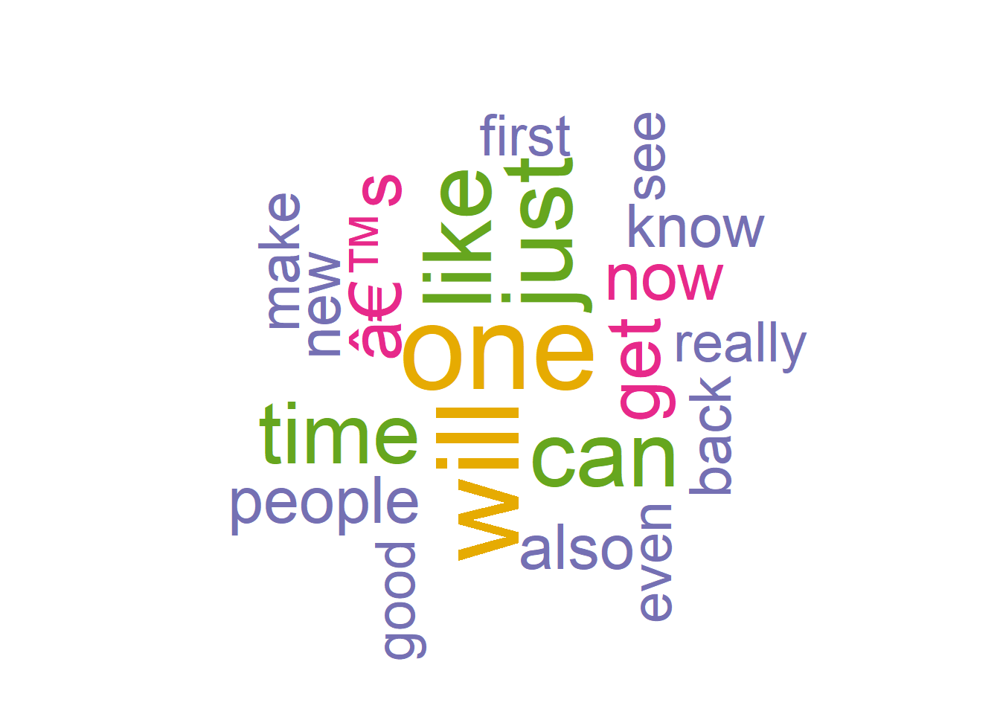
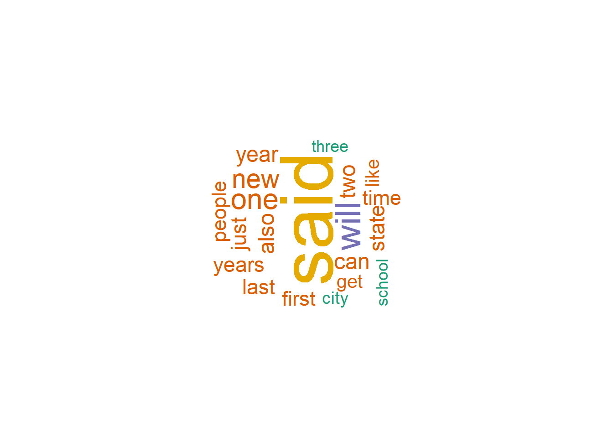
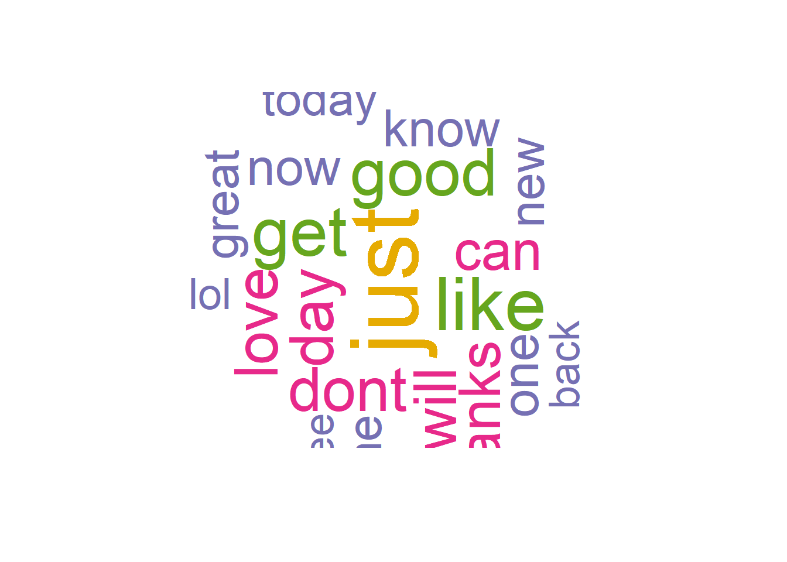
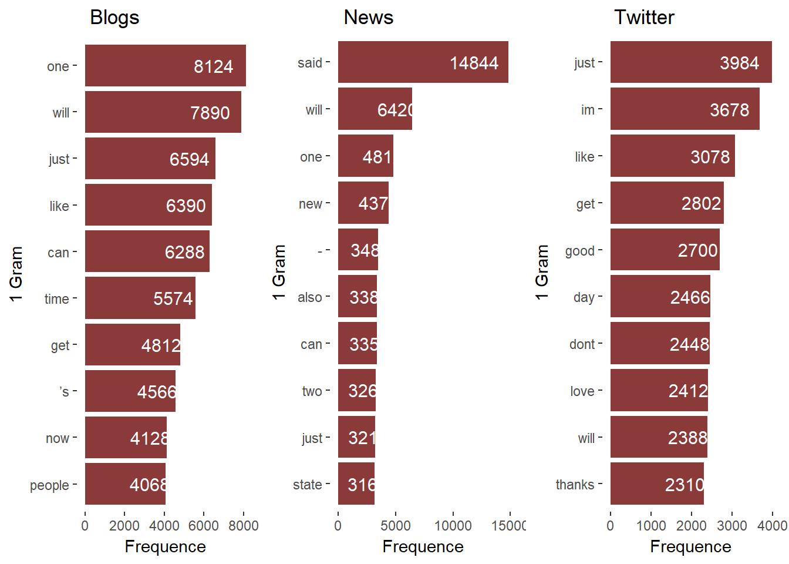
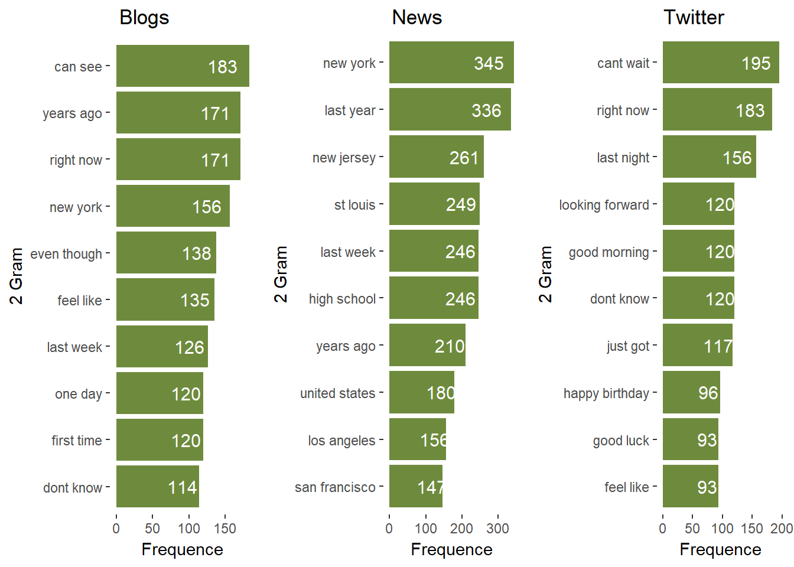
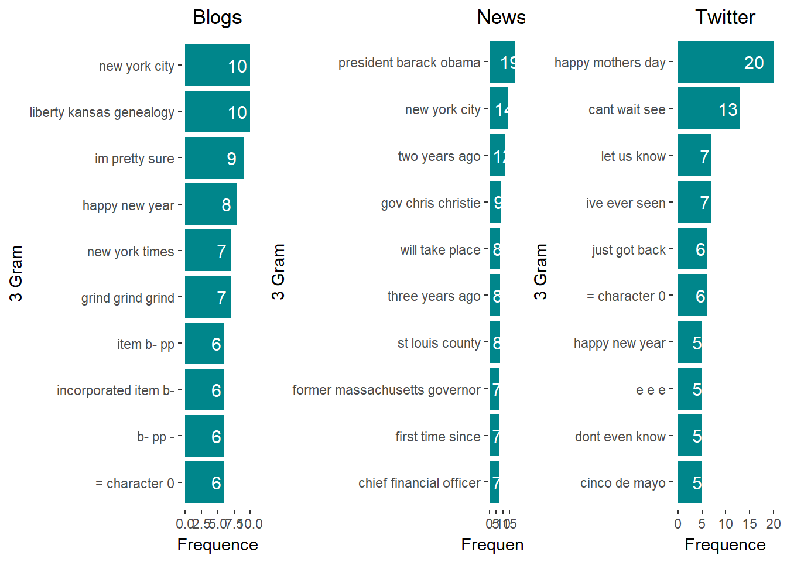
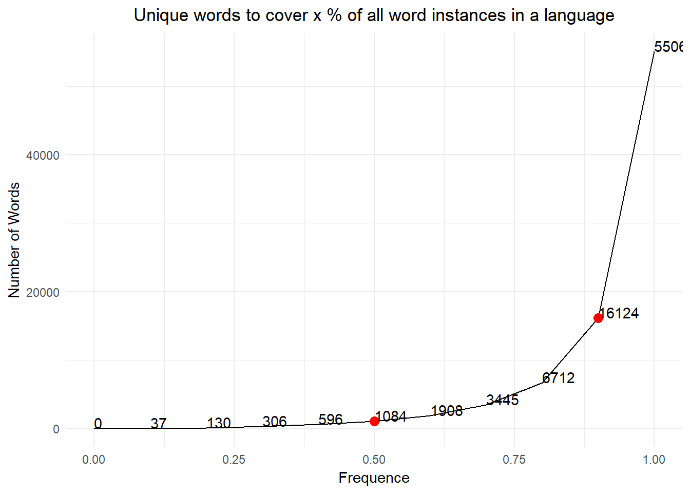

z---
title: "Exploratory analysis of SwiftKey dataset (English)"
author: "Benoit Fedit"
date: "25 November 2017"
output: 
  html_document:
    keep_md: true
---


## Background

The first step in building a predictive model for text is understanding the distribution and relationship between the words, tokens, and phrases in the text. The goal of this task is to understand the basic relationships you observe in the data and prepare to build your first linguistic models.

**Tasks to accomplish**

Exploratory analysis - perform a thorough exploratory analysis of the data, understanding the distribution of words and relationship between the words in the corpora.
Understand frequencies of words and word pairs - build figures and tables to understand variation in the frequencies of words and word pairs in the data.

**Questions to consider**
1. Some words are more frequent than others - what are the distributions of word frequencies?
2. What are the frequencies of 2-grams and 3-grams in the dataset?
3. How many unique words do you need in a frequency sorted dictionary to cover 50% of all word instances in the language? 90%?
4. How do you evaluate how many of the words come from foreign languages?
5. Can you think of a way to increase the coverage -- identifying words that may not be in the corpora or using a smaller number of words in the dictionary to cover the same number of phrases?

## Data

The dataset for this project is available here:
[SwiftKey.zp](https://d396qusza40orc.cloudfront.net/dsscapstone/dataset/Coursera-SwiftKey.zip)

## Load library & read files

```r
library("ggplot2"); 
```

```
## Need help getting started? Try the cookbook for R:
## http://www.cookbook-r.com/Graphs/
```

```r
library(NLP); 
```

```
## 
## Attaching package: 'NLP'
```

```
## The following object is masked from 'package:ggplot2':
## 
##     annotate
```

```r
library(tm); 
library(RWeka); 
library("wordcloud"); 
```

```
## Loading required package: RColorBrewer
```

```r
library("gridExtra");

knitr::opts_knit$set(root.dir = "H:\\Data Science Johns Hopkins\\Capstone Project\\Coursera-SwiftKey\\final\\en_US")
blogs<-readLines("en_US.blogs.txt",encoding="UTF-8")
news<-readLines("en_US.news.txt",encoding="UTF-8")
```

```
## Warning in readLines("en_US.news.txt", encoding = "UTF-8"): incomplete
## final line found on 'en_US.news.txt'
```

```r
twitter<-readLines("en_US.twitter.txt",encoding="latin1")
```

```
## Warning in readLines("en_US.twitter.txt", encoding = "latin1"): line 167155
## appears to contain an embedded nul
```

```
## Warning in readLines("en_US.twitter.txt", encoding = "latin1"): line 268547
## appears to contain an embedded nul
```

```
## Warning in readLines("en_US.twitter.txt", encoding = "latin1"): line
## 1274086 appears to contain an embedded nul
```

```
## Warning in readLines("en_US.twitter.txt", encoding = "latin1"): line
## 1759032 appears to contain an embedded nul
```

## Data Cleansing


```r
sampleSize<-10000 
cleanData<-function(x) { 
 # x<-tm_map(x,removeWords, badtext)
 # x<-tm_map(x, content_transformer(tolower))
myCorpus <- sample(x,sampleSize) 
myCorpus <- Corpus(VectorSource(myCorpus))
myCorpus <- tm_map(myCorpus, tolower)
myCorpus <- tm_map(myCorpus, PlainTextDocument)
myCorpus <- tm_map(myCorpus,removePunctuation,preserve_intra_word_dashes = TRUE)
myCorpus <- tm_map(myCorpus, removeNumbers)
myCorpus <- tm_map(myCorpus, removeWords,stopwords("english"))
myCorpus <- tm_map(myCorpus, stripWhitespace)
  }
blogsClean<-cleanData(blogs); newsClean<-cleanData(news); twitterClean<-cleanData(twitter)
```

## Some words are more frequent than others - what are the distributions of word frequencies?

```r
createWC<-function(x){
words<-WordTokenizer(x)
wc<-wordcloud(words, scale=c(5,0.5), max.words=20, random.order=FALSE, 
          rot.per=0.5, use.r.layout=FALSE, colors=brewer.pal(6, "Dark2"))
}

{
wc1<-createWC(blogsClean)
wc2<-createWC(newsClean)
wc2<-createWC(twitterClean)
}
```


## 2. What are the frequencies of 2-grams and 3-grams in the dataset?

```r
gramToken<-function(x,n){
df<-NGramTokenizer(x)
df<-NGramTokenizer(df, Weka_control(min=n, max=n))
df<-data.frame(table(df))
df<-df[order(df$Freq, decreasing = TRUE),]
}
blogsG1<-gramToken(blogsClean,1);blogsG2<-gramToken(blogsClean,2);blogsG3<-gramToken(blogsClean,3);
newsG1<-gramToken(newsClean,1);newsG2<-gramToken(newsClean,2);newsG3<-gramToken(newsClean,3);
twitterG1<-gramToken(twitterClean,1);twitterG2<-gramToken(twitterClean,2);twitterG3<-gramToken(twitterClean,3);
```


##### Gram One

```r
b1<-  ggplot(blogsG1[1:10,], aes(x = reorder(df,Freq), y = Freq,label = Freq)) + 
  geom_bar(stat = "identity",fill="indianred4")+
  geom_text(size = 4, position = position_stack(vjust = 0.8),colour = "white")+
  coord_flip()+
  labs(title="Blogs", x ="1 Gram", y = "Frequence")+
  theme(plot.title = element_text(hjust = 0.1))+ 
  theme(panel.background = element_blank())
b2<-ggplot(newsG1[1:10,], aes(x = reorder(df,Freq), y = Freq,label = Freq)) + 
  geom_bar(stat = "identity",fill="indianred4")+
  geom_text(size = 4, position = position_stack(vjust = 0.8),colour = "white")+
  coord_flip()+
  labs(title="News", x ="1 Gram", y = "Frequence")+
  theme(plot.title = element_text(hjust = 0.1))+ 
  theme(panel.background = element_blank())
b3<-ggplot(twitterG1[1:10,], aes(x = reorder(df,Freq), y = Freq,label = Freq)) + 
  geom_bar(stat = "identity",fill="indianred4")+
  geom_text(size = 4, position = position_stack(vjust = 0.8),colour = "white")+
  coord_flip()+
  labs(title="Twitter", x ="1 Gram", y = "Frequence")+
  theme(plot.title = element_text(hjust = 0.1))+ 
  theme(panel.background = element_blank())
grid.arrange(b1, b2, b3,  ncol=3)
```



##### Gram Two

```r
b1<-  ggplot(blogsG2[1:10,], aes(x = reorder(df,Freq), y = Freq,label = Freq)) + 
  geom_bar(stat = "identity",fill="darkolivegreen4")+
  geom_text(size = 4, position = position_stack(vjust = 0.8),colour = "white")+
  coord_flip()+
  labs(title="Blogs", x ="2 Gram", y = "Frequence")+
  theme(plot.title = element_text(hjust = 0.1))+ 
  theme(panel.background = element_blank())
b2<-ggplot(newsG2[1:10,], aes(x = reorder(df,Freq), y = Freq,label = Freq)) + 
  geom_bar(stat = "identity",fill="darkolivegreen4")+
  geom_text(size = 4, position = position_stack(vjust = 0.8),colour = "white")+
  coord_flip()+
  labs(title="News", x ="2 Gram", y = "Frequence")+
  theme(plot.title = element_text(hjust = 0.1))+ 
  theme(panel.background = element_blank())
b3<-ggplot(twitterG2[1:10,], aes(x = reorder(df,Freq), y = Freq,label = Freq)) + 
  geom_bar(stat = "identity",fill="darkolivegreen4")+
  geom_text(size = 4, position = position_stack(vjust = 0.8),colour = "white")+
  coord_flip()+
  labs(title="Twitter", x ="2 Gram", y = "Frequence")+
  theme(plot.title = element_text(hjust = 0.1))+ 
  theme(panel.background = element_blank())
grid.arrange(b1, b2, b3,  ncol=3)
```



##### Gram Three

```r
b1<-  ggplot(blogsG3[1:10,], aes(x = reorder(df,Freq), y = Freq,label = Freq)) + 
  geom_bar(stat = "identity",fill="turquoise4")+
  geom_text(size = 4, position = position_stack(vjust = 0.8),colour = "white")+
  coord_flip()+
  labs(title="Blogs", x ="3 Gram", y = "Frequence")+
  theme(plot.title = element_text(hjust = 0.5))+ 
  theme(panel.background = element_blank())
b2<-ggplot(newsG3[1:10,], aes(x = reorder(df,Freq), y = Freq,label = Freq)) + 
  geom_bar(stat = "identity",fill="turquoise4")+
  geom_text(size = 4, position = position_stack(vjust = 0.8),colour = "white")+
  coord_flip()+
  labs(title="News", x ="3 Gram", y = "Frequence")+
  theme(plot.title = element_text(hjust = 0.5))+ 
  theme(panel.background = element_blank())
b3<-ggplot(twitterG3[1:10,], aes(x = reorder(df,Freq), y = Freq,label = Freq)) + 
  geom_bar(stat = "identity",fill="turquoise4")+
  geom_text(size = 4, position = position_stack(vjust = 0.8),colour = "white")+
  coord_flip()+
  labs(title="Twitter", x ="3 Gram", y = "Frequence")+
  theme(plot.title = element_text(hjust = 0.5))+ 
  theme(panel.background = element_blank())
grid.arrange(b1, b2, b3,  ncol=3)
```



## 3. How many unique words do you need in a frequency sorted dictionary to cover 50% of all word instances in the language? 90%?

```r
data<-c(blogsClean,newsClean,twitterClean)
data<-gramToken(data,1)
nbWordFreq<-function(x){
  totFreq<-sum(data$Freq)  
  i<-1
  cumFreq<-0
  coverPerc<-0
  if(x==0){
      return(0)
  }else{
      while(coverPerc<x){
        cumFreq<-cumFreq + data$Freq[i]
        coverPerc<-cumFreq/totFreq
        i<-i+1
      }
    return(i)
  }
}
freqWord<-seq(0, 1, 0.1)
coverWords<-data.frame(freq=double(),nbWords=integer())
for(i in 1:length(freqWord)){
  coverWords[i,1]<-freqWord[i]
  coverWords[i,2]<-nbWordFreq(freqWord[i])
}
ggplot(coverWords, aes(x=freq, y=nbWords)) +
   geom_line()+
  geom_point(data=coverWords[coverWords$freq %in% c(0.5,0.9),],color="red",size=3) +
  geom_text(aes(label=nbWords),hjust=0, vjust=0)+
  labs(title="Unique words to cover x % of all word instances in a language", x ="Frequence", y = "Number of Words")+
  theme_minimal()+
  theme(plot.title = element_text(hjust = 0.5))
```



## 4. How do you evaluate how many of the words come from foreign languages?

That's a tricky one! 
We actually already know that our dataset contains only english words.
However if we were to evaluate how many of the words come from a different langage we would need to create a similar 
dictionary as we've done in this project and then count the number of matching words between the two dictionary. 
We could then use the tm_map function to remove the non-english words we should still pay attention to this as 
many languages have the same words and same spelling.
SO in this case we would need a dictionary that contains words from the other language while excluding words that 
also exist in english. That's getting a bit complicated now and I'm pretty sure that it's even more complicated than this!

## 5. Can you think of a way to increase the coverage -- identifying words that may not be in the corpora or using a smaller number of words in the dictionary to cover the same number of phrases?

1. We could potentially remove all the unique words or the ones with low frequency (e.g. freq<3)
2. Identify the same words but with different spelling (e.g.color and colour)
3. Identify the words writtent with typo and group them with their correct word
4. Identify slang words and group them with the standard word
5. Maybe cluster the close synonims together
