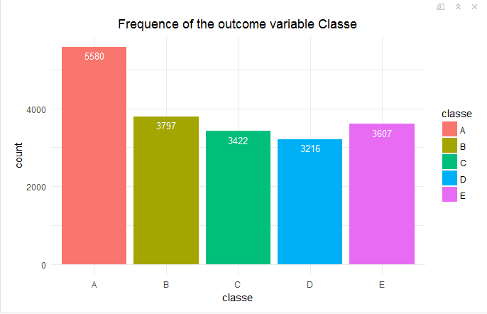

---
output:
  pdf_document: default
  html_document: default
---
title: "Prediction Assignment Writeup"  
author: "Benoit Fedit"  
date: "16 August 2017"  
output: html_document  
---

## Background

Using devices such as Jawbone Up, Nike FuelBand, and Fitbit it is now possible to collect a large amount of data about personal activity relatively inexpensively. These type of devices are part of the quantified self movement - a group of enthusiasts who take measurements about themselves regularly to improve their health, to find patterns in their behavior, or because they are tech geeks. One thing that people regularly do is quantify how much of a particular activity they do, but they rarely quantify how well they do it. In this project, your goal will be to use data from accelerometers on the belt, forearm, arm, and dumbell of 6 participants. They were asked to perform barbell lifts correctly and incorrectly in 5 different ways. More information is available from the website here: http://web.archive.org/web/20161224072740/http:/groupware.les.inf.puc-rio.br/har (see the section on the Weight Lifting Exercise Dataset).

## Data

The training data for this project are available here:
[pml-training.csv](https://d396qusza40orc.cloudfront.net/predmachlearn/pml-training.csv)


The test data are available here:
[pml-testing.csv](https://d396qusza40orc.cloudfront.net/predmachlearn/pml-testing.csv)


## What you should submit

The goal of your project is to predict the manner in which they did the exercise. This is the "classe" variable in the training set. You may use any of the other variables to predict with. You should create a report describing how you built your model, how you used cross validation, what you think the expected out of sample error is, and why you made the choices you did. You will also use your prediction model to predict 20 different test cases.

```r
knitr::opts_chunk$set(echo = TRUE)
```

## Load library & read files


```r
library(ggplot2)
library(dplyr)
library(caret)
library(gridExtra)
library(data.table)
library(randomForest)
setwd("H:/Data Science Johns Hopkins/practical-machine-learning/Week4")
training <- read.csv("pml-training.csv", na.strings=c("NA","#DIV/0!", ""))
testing <- read.csv("pml-testing.csv", na.strings=c("NA","#DIV/0!", ""))
cbind(training=dim(training),testing=dim(testing))
```

```
##      training testing
## [1,]    19622      20
## [2,]      160     160
```

There are 160 columns in each set however they are probably some columns that are not relevant for our analysis.


## Data Cleaning

The maximum missing values ratio I dediced to allow is 25% so all columns with more than 25% missing values will be removed.
We'll aslo remove the first 7 columns as they are irelevant for our analysis.


```r
# drop columns with at least 25% missing values
training<-training[, which(colMeans(is.na(training)) < 0.25)]
testing <- testing[, which(colMeans(is.na(testing)) < 0.25)]
# remove the first 7 columns
training<-training[,-c(1:7)]
testing <- testing[,-c(1:7)]
cbind(training=dim(training),testing=dim(testing))
```

```
##      training testing
## [1,]    19622      20
## [2,]       53      53
```
As expected there were quite a few columns with too many NA values and other columns not usefull.

## Distribution of the outcome variable

```r
ggplot(data=training,aes(x=classe, fill=classe)) + geom_bar() +theme_minimal()+
geom_text(stat="count",aes(label=..count..), vjust=1.6, color="white", size=3.5)+
theme(plot.title = element_text(hjust = 0.5))+
ggtitle("Frequence of the outcome variable Classe")
```



## Is there any colinear variables?

```r
# exclude the outcome column and non numeric columns
M<-abs(cor(training[, -which(colnames(training)=="classe") & sapply(training, class) == "numeric" ]))
diag(M)<-0
which(M>0.8,arr.ind = T)
```

```
##                  row col
## yaw_belt           3   1
## roll_belt          1   3
## gyros_arm_y       11  10
## gyros_arm_x       10  11
## gyros_dumbbell_z  18  16
## gyros_forearm_z   25  16
## gyros_dumbbell_x  16  18
## gyros_forearm_z   25  18
## gyros_forearm_z   25  24
## gyros_dumbbell_x  16  25
## gyros_dumbbell_z  18  25
## gyros_forearm_y   24  25
```
As we can see there are a dozen of variables highly corelated to each other ( coef > 0.8) so it seems a good idea to reduce the number of columns to run our model faster and also to avoid over fitting.

## Data PArtitioning

```r
inTrain <- createDataPartition(y = training$classe, p = 3/4, list = FALSE)
subTraining <- training[inTrain,]
subTesting <- training[-inTrain,]
```

## PCA - Components Selection

```r
prComp <- prcomp(subTraining[, -which(colnames(subTraining)=="classe")])
summary(prComp)
```

```
## Importance of components:
##                             PC1      PC2      PC3      PC4       PC5
## Standard deviation     601.1063 535.0376 470.1048 381.4544 355.15039
## Proportion of Variance   0.2642   0.2093   0.1616   0.1064   0.09224
## Cumulative Proportion    0.2642   0.4736   0.6352   0.7416   0.83382
##                             PC6       PC7       PC8       PC9      PC10
## Standard deviation     255.1277 201.36125 173.67107 157.82661 118.51908
## Proportion of Variance   0.0476   0.02965   0.02206   0.01822   0.01027
## Cumulative Proportion    0.8814   0.91106   0.93312   0.95134   0.96161
##                            PC11     PC12     PC13     PC14     PC15
## Standard deviation     97.35790 89.38123 76.50345 68.60410 62.60406
## Proportion of Variance  0.00693  0.00584  0.00428  0.00344  0.00287
## Cumulative Proportion   0.96854  0.97438  0.97866  0.98210  0.98497
##                            PC16     PC17     PC18     PC19     PC20
## Standard deviation     56.80999 52.99213 49.81071 48.98756 41.93305
## Proportion of Variance  0.00236  0.00205  0.00181  0.00175  0.00129
## Cumulative Proportion   0.98733  0.98938  0.99120  0.99295  0.99424
##                            PC21     PC22    PC23     PC24     PC25    PC26
## Standard deviation     37.80451 35.24474 33.0847 30.80030 25.77959 23.3228
## Proportion of Variance  0.00105  0.00091  0.0008  0.00069  0.00049  0.0004
## Cumulative Proportion   0.99528  0.99619  0.9970  0.99769  0.99817  0.9986
##                            PC27     PC28     PC29     PC30     PC31
## Standard deviation     21.51605 20.82541 17.26184 15.17070 13.87984
## Proportion of Variance  0.00034  0.00032  0.00022  0.00017  0.00014
## Cumulative Proportion   0.99891  0.99922  0.99944  0.99961  0.99975
##                           PC32    PC33    PC34    PC35    PC36    PC37
## Standard deviation     9.95651 7.55221 7.27864 6.69559 6.12166 3.77017
## Proportion of Variance 0.00007 0.00004 0.00004 0.00003 0.00003 0.00001
## Cumulative Proportion  0.99982 0.99987 0.99990 0.99994 0.99996 0.99998
##                           PC38    PC39 PC40  PC41  PC42   PC43   PC44
## Standard deviation     3.51381 3.36739 2.13 1.932 1.094 0.5073 0.4155
## Proportion of Variance 0.00001 0.00001 0.00 0.000 0.000 0.0000 0.0000
## Cumulative Proportion  0.99998 0.99999 1.00 1.000 1.000 1.0000 1.0000
##                          PC45   PC46   PC47   PC48   PC49  PC50   PC51
## Standard deviation     0.3624 0.3172 0.3157 0.2432 0.1956 0.185 0.1059
## Proportion of Variance 0.0000 0.0000 0.0000 0.0000 0.0000 0.000 0.0000
## Cumulative Proportion  1.0000 1.0000 1.0000 1.0000 1.0000 1.000 1.0000
##                         PC52
## Standard deviation     0.037
## Proportion of Variance 0.000
## Cumulative Proportion  1.000
```

Keeping the first 15 components seems reasonable as it preserves 98.5% variance and should allow the random forest
model to run fast enough.

## PCA Implementation

```r
# perform PCA extraction on the new training and testing sets
preProc <- preProcess(subTraining[,-which(colnames(subTraining)=="classe")], method="pca", pcaComp=15)
trainPC <- predict(preProc, subTraining[,-which(colnames(subTraining)=="classe")])
testPC  <- predict(preProc,  subTesting)
```


## Random Forest with PCA

```r
train_control<- trainControl(method="cv", number=10)
# I was thinking to use cross validation using nfolds for my rf model but 
# as rf randomizes the variable selection during each tree split it's not prone to # overfit unlike other models
# compute the model with pca predictors
rfPCA<-randomForest(subTraining$classe~.,data=trainPC,method="rf")
print(rfPCA)
```

```
## 
## Call:
##  randomForest(formula = subTraining$classe ~ ., data = trainPC,      method = "rf") 
##                Type of random forest: classification
##                      Number of trees: 500
## No. of variables tried at each split: 3
## 
##         OOB estimate of  error rate: 3.17%
## Confusion matrix:
##      A    B    C    D    E class.error
## A 4109   21   33   19    3  0.01816010
## B   55 2732   54    2    5  0.04073034
## C   20   39 2474   29    5  0.03622906
## D   10    5   91 2300    6  0.04643449
## E    9   26   23   12 2636  0.02586844
```


The estimated out of sample error is around 3%.
Let's now run our model against the subtestingset as random forest is not prone
to over-fiting I'm expecting to have a similar result on the subtesting set.

## Prediction on subtesting set

```r
predRF <- predict(rfPCA, testPC)
rsltRF <- confusionMatrix(predRF, subTesting$classe)
rsltRF
```

```
## Confusion Matrix and Statistics
## 
##           Reference
## Prediction    A    B    C    D    E
##          A 1374   21    7    6    0
##          B    5  912   11    2    8
##          C   10   15  823   35    5
##          D    3    1   11  758    6
##          E    3    0    3    3  882
## 
## Overall Statistics
##                                           
##                Accuracy : 0.9684          
##                  95% CI : (0.9631, 0.9731)
##     No Information Rate : 0.2845          
##     P-Value [Acc > NIR] : < 2.2e-16       
##                                           
##                   Kappa : 0.96            
##  Mcnemar's Test P-Value : 4.93e-05        
## 
## Statistics by Class:
## 
##                      Class: A Class: B Class: C Class: D Class: E
## Sensitivity            0.9849   0.9610   0.9626   0.9428   0.9789
## Specificity            0.9903   0.9934   0.9839   0.9949   0.9978
## Pos Pred Value         0.9759   0.9723   0.9268   0.9730   0.9899
## Neg Pred Value         0.9940   0.9907   0.9920   0.9888   0.9953
## Prevalence             0.2845   0.1935   0.1743   0.1639   0.1837
## Detection Rate         0.2802   0.1860   0.1678   0.1546   0.1799
## Detection Prevalence   0.2871   0.1913   0.1811   0.1588   0.1817
## Balanced Accuracy      0.9876   0.9772   0.9733   0.9688   0.9883
```

As expected the overall accuracy is still around 97% we now have to run our RF model
on the real testing set and see how it goes.

## Prediction on the real testing set

```r
# predict outcome classe on the real testing set
testingPC <- predict(preProc,  testing)
predClasse <- predict(rfPCA, testingPC, type="class")
testing$Classe<-predClasse
result<-data.frame(paste0( 1:nrow(testing)),testing$Classe)
#result
```


```r
#write.table(result, file = "result.csv", append = FALSE,col.names=TRUE)
```

I obtained all the classes correct with this model, I've tried only the RF model as it tends to be more accurate than any other classification trees model. 
